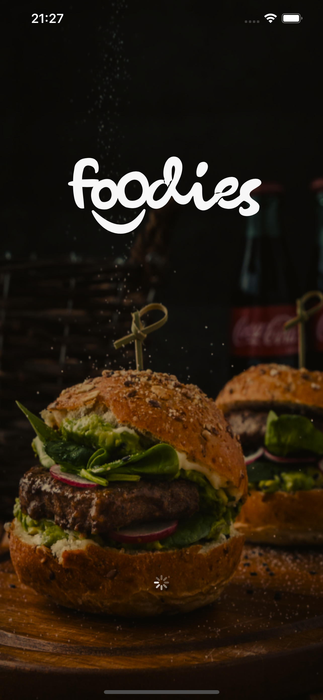

<h1 align="center">
  
</h1>

<h3 align="center">
  Foodies React Native
</h3>

<p align="center">Aplicativo React Native para o projeto Foodies</p>

<p align="center">
  <a href="#%EF%B8%8F-about-the-project">Sobre o projeto</a>&nbsp;&nbsp;&nbsp;|&nbsp;&nbsp;&nbsp;
  <a href="#-technologies">Técnologias</a>&nbsp;&nbsp;&nbsp;|&nbsp;&nbsp;&nbsp;
  <a href="#-getting-started">Introdução </a>&nbsp;&nbsp;&nbsp;|&nbsp;&nbsp;&nbsp;
  <a href="#-how-to-contribute">Como contribuir </a>&nbsp;&nbsp;&nbsp;|&nbsp;&nbsp;&nbsp;
  <a href="#-license">Licença</a>
</p>

## 💇🏻‍♂️ Sobre o projeto

Projeto em desenvolvimento...

Criado em React Native. Esse aplicativo oferece uma experiência de usuário suave e moderna que pode ser executada em ambos Android e iOS.

O aplicativo de delivery é altamente intuitivo e fácil de usar. Isso é possível graças à sua interface de usuário simples e intuitiva. Com alguns toques na tela, você pode fazer seu pedido de comida em poucos segundos. Além disso, a arquitetura de componentes do React Native torna o aplicativo mais rápido e leve, garantindo que os usuários tenham uma experiência fluida.

Uma das principais vantagens do React Native é a capacidade de reutilizar componentes. Isso significa que podemos construir e atualizar rapidamente o aplicativo, garantindo que os usuários tenham sempre uma experiência de usuário excepcional. Com React Native, podemos criar uma base de código compartilhada para as versões Android e iOS, economizando tempo e recursos.

O aplicativo de delivery também oferece recursos poderosos de personalização. Os usuários podem criar perfis personalizados e salvar suas opções de pagamento para uma experiência de compra ainda mais rápida. Além disso, o aplicativo tem uma área de avaliação, permitindo que os usuários avaliem e comentem sobre seus restaurantes favoritos.

Por fim, o nosso aplicativo de delivery React Native oferece suporte a notificações push, permitindo que os usuários acompanhem o status de seus pedidos em tempo real. Isso garante que eles sempre estejam informados sobre o status de seus pedidos, desde a preparação da refeição até a entrega.

## Em resumo
 o aplicativo de delivery é uma solução moderna e intuitiva para aqueles que buscam uma experiência de compra de comida rápida, fácil e personalizada. O aplicativo oferece uma experiência de usuário excepcional, reutilização de componentes e recursos poderosos de personalização, tornando-o a escolha perfeita para aqueles que buscam eficiência e comodidade.

<h1 align="center">
  
</h1>

## 🚀 Tecnologias

Tecnologias que usei para desenvolver este cliente móvel

- [ReactJS](https://reactjs.org/)
- [TypeScript](https://www.typescriptlang.org/)
- [React Native](https://reactnative.dev/)
- [React Navigation](https://reactnavigation.org/)
- [React Native Vector Icons](https://github.com/oblador/react-native-vector-icons)
- [Styled Components](https://styled-components.com/)
- [Axios](https://github.com/axios/axios)
- [React Native Reanimated](https://docs.swmansion.com/react-native-reanimated)
- [Gesture Handler](https://docs.swmansion.com/react-native-gesture-handler/docs/)
- [Eslint](https://eslint.org/)
- [Prettier](https://prettier.io/)
- [EditorConfig](https://editorconfig.org/)

## 💻 Começando

### Requirements

Ambiente configurado para emular aplicativos.

**Clone o projeto e acesse a pasta**

```bash
$ git clone git@github.com:CristianoVieira1/travel.git && cd travel
```

**Siga os passos abaixo**

```bash
# Install the dependencies
$ yarn

# If you are going to emulate with android, run this command
# Be sure to have the emulator open
$ yarn android

# If you are going to emulate with ios, run this command
$ yarn ios
```

## 🤔 como contribuir

**Faça uma bifurcação deste repositório**

```bash
# Fork using GitHub official command line
# If you don't have the GitHub CLI, use the web site to do that.

$ gh repo fork CristianoVieira1/travel
```

**Siga os passos abaixo**

```bash
# Clone your fork
$ git clone your-fork-url && cd travel

# Create a branch with your feature
$ git checkout -b my-feature

# Make the commit with your changes
$ git commit -m 'feat: My new feature'

# Send the code to your remote branch
$ git push origin my-feature
```

Depois que sua solicitação pull for mesclada, você poderá excluir sua ramificação

## 📝 License

Este projeto está licenciado sob a licença MIT - consulte o arquivo [LICENSE](LICENSE) para obter detalhes.

---

Feito com 💜 por Cristiano Borges 👋 [linkedin](https://www.linkedin.com/in/cristianobv/)

Conheça meu Portfólio 🚀 [portfolio](https://cristianovieira1.github.io/portfolio/)
